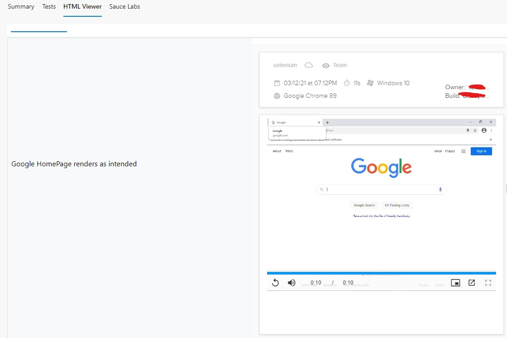

## Overview of Saucelabs

For those of you that don't know, within the QA Automation world there are many tools in which we can leverage to distribute and run our Selenium tests on. One popular tool that I've used in the market is Saucelabs. While it is entirely possible to utilize your CI job's resources to run these tests, one thing that made using Saucelabs very appealing to me was the ability to actually view video playback of your test in action. This allowed for myself and the rest of the QA Automation team I work with to quickly identify flakiness within our scripts, or clearly identify a defect within the application under test.

## Saucelabs and Azure Pipelines

Most of the time that I've used Saucelabs, I was utilizing tools such as Jenkins to execute my jobs and view my results accordingly with Saucelabs own proprietary extensions. In fact, Saucelabs actually offers support for multiple CI platforms (just to name a few):

* [Jenkins](https://wiki.saucelabs.com/display/DOCS/Setting+Up+Sauce+Labs+with+Jenkins)
* [Bamboo](https://wiki.saucelabs.com/display/DOCS/Setting+Up+Sauce+Labs+with+Bamboo)
* [TeamCity](https://wiki.saucelabs.com/display/DOCS/Setting+Up+Sauce+Labs+with+TeamCity)

They even have an official Azure Pipelines extension as well! The problem, however, is that they actually officially stopped supporting the extension. It also seems that they aren't even considering maintaining it, and encouraging me to comment on a thread that I highly doubt their product or engineering team is even taking seriously:


That's pretty shameful, as Azure Pipelines has grown to be a very appealing CI platform in the last few years. Almost every single client I've interacted with thus far in my career has transitioned from a particular CI platform, to Azure Pipelines. So since the extension is no longer supported, how can we recreate the functionality their prior extension did? Luckily for us, there's a work around.

## Saucelabs HTML Embedding Capability

Hidden deep within the Saucelabs Documentation, there is a capability that allows for generating custom made HTML reports with videos embedded within them:

[Saucelabs Embedded Documentation](https://wiki.saucelabs.com/display/DOCS/Embedding+Test+Results+in+HTML+Pages)

To quickly summarize this wiki page, there are really three requirements here to generate custom HTML reports:

1. An html file containing a script such as the one below to embed an iframe of your job:

```html
<script src="https://app.saucelabs.com/video-embed/YOUR_JOB_ID.js?auth=AUTH_TOKEN">
</script>
```

2. A generated md5 authorization token based on a particular job/test id and your sauce credentials.

3. A test case / job id orginating from a particular build.

Essentially, what we can do with this is generate a static html file via a quick command line application (or within your test automation framework, d on requirements) containing all of the videos of our executed test cases from our job as an artifact within our pipeline by utilizing a html publish task in the AzDO market place: [Publish HTML](https://marketplace.visualstudio.com/items?itemName=JakubRumpca.azure-pipelines-html-report).

With that being said, the example I will be demonstrating in this post is utilizing an API client for Saucelabs I created in Go to retrieve build related information of my test execution in which I generate my reports off of.

Let's get started!

## Defining a build name for your test execution in Saucelabs

One important piece of information our test execution needs (on the framework level) is a build execution name. While there are many ways to build out our capabilities for Selenium, here is what I'm currently doing within my remote web driver capabilities in my Geb/Spock implementation:

```groovy
String sauceUsername = System.getenv("SAUCE_USER")
String sauceAccessKey = System.getenv("SAUCE_KEY")

//capabilities
MutableCapabilities sauceOptions = new MutableCapabilities();
sauceOptions.setCapability("build", System.getProperty("sauceBuildName"))
sauceOptions.setCapability("name", System.getProperty("testName"))

ChromeOptions browserOptions = new ChromeOptions()
browserOptions.setExperimentalOption("w3c", true)
browserOptions.setCapability("platformName", "Windows 10")
browserOptions.setCapability("browserVersion", "latest")
browserOptions.setCapability("sauce:options", sauceOptions)
```

Where `sauceBuildName` is a system property I am forwarding within my gradle execution in my CI:

```bash
gradlew test -Xmx3072m -Dgeb.env=sauceLabs -Dgeb.build.baseUrl=http://www.google.com -Dtest.set=Smoke -DsauceBuildName=**mybuildname**
```

What this will allow me to do is be able to give an identifiable name of my executed build within Saucelabs like this:


Once we have that, we can then utilize my Sauce API Client to retrieve our respective build information.

## Interfacing with the Saucelabs API in Go

### Prereqs

Ensure you pull my [Saucelabs API Client](https://github.com/ssulei7/saucelabs-client-go) into your go.mod file.

If you never used used dependencies in go, please refer to the official [Golang Documentation](https://golang.org/doc/modules/managing-dependencies).

Be sure to also to view the README.MD file to ensure you can authenticate appropriately into my client library. Here's a quick example of instantiating a new client:

```go
c := sauce.NewClient(os.getEnv("SAUCE_KEY"), os.getEnv("SAUCE_USER"), "")
```

Where `""` allows for us to use Saucelabs default base URL.


### Pulling down / filtering builds for a particular user

Once you have the client library pulled down and instantiate a new client, you can then utilize the library to pull all builds and filter by the build name:
```go
c := sauce.NewClient(os.getEnv("SAUCE_KEY"), os.getEnv("SAUCE_USER"), "")
builds, err := c.GetBuilds()
var build sauce.Build
if err == nil {
    //filter and find the build containing the build name i had within my 
    for _, b := range builds {
        if b.Name == os.getEnv("MY_BUILD") {
            build = b
            break
        }
    }
}

if build == nil {
    //our build doesn't exist within our script, terminate execution
    os.Exit(1)
}
```

Once we find / validate the appropriate build exists, now we must find all the test case id's that were executed within this build.

### Finding particular test cases for a build

To find test cases associated with our build, we can pull down all the jobs that were executed by a particular user:

```go
jobs, err := c.GetJobs()

//where we will store all filtered jobs
var myJobs []sauce.Job
```

And then we can go ahead and find all the jobs containing our build name and add it to our list:

```go
if err == nil {
    // iterate thru jobs to find those that are within my build
    for _, job := range jobs {
        //check if the current job contains my build name
        if build.Name == job.BaseConfig.SauceOptions.Build {
            //append this current job into my slice
            myJobs = append(myJobs, job)
        }
    }
}
```

### Generating the HTML Report

Once we then find all of our job id's, we can then define a function called `generateHtml` where we can build a simple html file that will:

1. Generate an md5 auth token to view our test case video without the need to login.
2. Generate Iframes of each test case executed within our build in our html file.
3. Organize them in a table using a css import of Bootstrap.

Our function should look something like this:

```go
func generateHtml(sauceKey, userName string, jobs *[]sauce.Job) {
var htmlTemplate = `
<!DOCTYPE html>
<html lang="en">

<head>
    <meta charset="UTF-8">
    <meta http-equiv="X-UA-Compatible" content="IE=edge">
    <meta name="viewport" content="width=device-width, initial-scale=1.0">
    <meta charset="UTF-8">

    <link href="https://cdn.jsdelivr.net/npm/bootstrap@5.0.0-beta2/dist/css/bootstrap.min.css" rel="stylesheet"
        integrity="sha384-BmbxuPwQa2lc/FVzBcNJ7UAyJxM6wuqIj61tLrc4wSX0szH/Ev+nYRRuWlolflfl" crossorigin="anonymous">
    <title>BuildResults</title>

</head>

<body>
    <table class="table table-light table-striped">
        <tr>
            <th>Test Case</th>
            <th>Test Case Video</th>
        </tr>
`

for _, job := range *jobs {
    hashKey := generateKey(sauceKey, userName, job.ID)
    scriptString := fmt.Sprintf(
        `<tr>
        <td class="align-middle">
            %s
        </td>
        <td class="align-middle">
            <div class="d-flex align-items-center justify-content-center">
                <script
                    src="https://app.saucelabs.com/job-embed/%s.js?auth=%s">
                    </script>
            </div>
        </td>
    </tr>`, job.BaseConfig.SauceOptions.Name, job.ID, hashKey)

    htmlTemplate += scriptString
}

htmlTemplate += `
</tr>
</table>
</body>

</html>
`
```

There's a lot going on here, but I will try to explain to the best of my ability. The first thing that we're doing is defining a `htmlTemplate` variable that contains the beginning our html file as a multi-line string, including:

* Our head in which we can reference bootstrap css
* The beginning of our body, which contains:
  * Our table with the appropriate styling from bootstrap
  * Our table header names as the first row

From there, in the next section of code:

```go
for _, job := range *jobs {
    hashKey := generateKey(sauceKey, userName, job.ID)
    scriptString := fmt.Sprintf(
        `<tr>
        <td class="align-middle">
            %s
        </td>
        <td class="align-middle">
            <div class="d-flex align-items-center justify-content-center">
                <script
                    src="https://app.saucelabs.com/job-embed/%s.js?auth=%s">
                    </script>
            </div>
        </td>
    </tr>`, job.BaseConfig.SauceOptions.Name, job.ID, hashKey)

    htmlTemplate += scriptString
}
```

We are iterating through all of jobs within our slice and doing the following:

* Generating an unique authentication token 
* Creating the appropriate script string within an html table row, and injecting our job name, id, and auth token into the script tag using Go's string formatter `fmt.Sprintf`
* Appending the table row string into our multi-line string template

One thing I'd like to highlight is the `generateKey` function, which is one I defined and looks as followed:

```go
func generateKey(sauceKey, userName, message string) string {
	key := []byte(fmt.Sprintf("%s:%s", userName, sauceKey))
	mac := hmac.New(md5.New, key)
	mac.Write([]byte(message))
	return hex.EncodeToString(mac.Sum(nil))
}
```

Here I am following the [advice](https://wiki.saucelabs.com/display/DOCS/Building+Sharable+Links+to+Test+Results) given by the Saucelabs team to generate an md5 auth token to our particular test case.

Once we complete iterating through our IDs and building out our table rows, we then do the following:

```go
htmlTemplate += `
	</tr>
    </table>
</body>

</html>
`

f, err := os.Create("index.html")

if err == nil {
    defer f.Close()
    f.Write([]byte(htmlTemplate))
}
```

Here, we are:

* Closing out our table tag, as well as our body/html tag
* Using Go's os package to create an index.html file
* Writing that multi-line html string as a byte array, into our newly created file.

More or less, that's how the Go code looks like, and here is all of the code strung together as a finished product:

```go
package main

import (
	"crypto/hmac"
	"crypto/md5"
	"encoding/hex"
	"fmt"
	"os"

	"github.com/ssulei7/saucelabs-client-go/sauce"
)

func generateHtml(sauceKey, userName string, jobs *[]sauce.Job) {
var htmlTemplate = `
<!DOCTYPE html>
<html lang="en">

<head>
    <meta charset="UTF-8">
    <meta http-equiv="X-UA-Compatible" content="IE=edge">
    <meta name="viewport" content="width=device-width, initial-scale=1.0">
    <meta charset="UTF-8">

    <link href="https://cdn.jsdelivr.net/npm/bootstrap@5.0.0-beta2/dist/css/bootstrap.min.css" rel="stylesheet"
        integrity="sha384-BmbxuPwQa2lc/FVzBcNJ7UAyJxM6wuqIj61tLrc4wSX0szH/Ev+nYRRuWlolflfl" crossorigin="anonymous">
    <title>BuildResults</title>

</head>

<body>
    <table class="table table-light table-striped">
        <tr>
            <th>Test Case</th>
            <th>Test Case Video</th>
        </tr>
`

for _, job := range *jobs {
    hashKey := generateKey(sauceKey, userName, job.ID)
    scriptString := fmt.Sprintf(
        `<tr>
        <td class="align-middle">
            %s
        </td>
        <td class="align-middle">
            <div class="d-flex align-items-center justify-content-center">
                <script
                    src="https://app.saucelabs.com/job-embed/%s.js?auth=%s">
                    </script>
            </div>
        </td>
    </tr>`, job.BaseConfig.SauceOptions.Name, job.ID, hashKey)

    htmlTemplate += scriptString
}

htmlTemplate += `
</tr>
</table>
</body>

</html>
`

func generateKey(sauceKey, userName, message string) string {
	key := []byte(fmt.Sprintf("%s:%s", userName, sauceKey))
	mac := hmac.New(md5.New, key)
	mac.Write([]byte(message))
	return hex.EncodeToString(mac.Sum(nil))
}

func main() {

	c := sauce.NewClient(os.getEnv("SAUCE_USER"), os.getEnv("SAUCE_KEY"), "")
    builds, err := c.GetBuilds()
    var build sauce.Build
    if err == nil {
        //filter and find the build containing the build name i had within my 
        for _, b := range builds {
            if b.Name == os.getEnv("MY_BUILD") {
                build = b
                break
            }
        }
    }

    if build == nil {
        //our build doesn't exist within our script, terminate execution
        os.Exit(1)
    }

    jobs, err := c.GetJobs()

    //where we will store all filtered jobs
    var myJobs []sauce.Job

	for _, job := range myJobs {
		if buildName == job.BaseConfig.SauceOptions.Build {
			myJobs = append(myJobs, job)
		}
	}

	generateHtml(os.getEnv("SAUCE_USER"), os.getEnv("SAUCE_KEY"), &myJobs)
}
```

We can the build our Go application by running
```bash
go build .
```

And copy over the appropriate executable into the repo containing our tests.

## Executing the HTML Generator within Azure Pipelines

Now, within our YML pipeline file, we can now add the following tasks:

```yaml
# run my tests
- task: Gradle@2
  inputs:
    workingDirectory: ''
    gradleWrapperFile: 'gradlew'
    gradleOptions: '-Xmx3072m -Dgeb.env=sauceLabs -Dgeb.build.baseUrl=http://www.google.com -Dtest.set=Smoke'
    javaHomeOption: 'JDKVersion'
    jdkVersionOption: '1.8'
    jdkArchitectureOption: 'x64'
    publishJUnitResults: true
    testResultsFiles: 'build/test-results/**/*.xml'
    tasks: 'test'

# run report generator
- task: CmdLine@2
  displayName: Run Report Generator
  inputs:
    script: './path-to-binary/mybinary.exe'

# publish html report file
- task: PublishHtmlReport@1
  inputs:
    tabName: 'Test Result Videos'
    reportDir: './path-to-report-file/index.html'
```

Where the cmdline task will run our executable (exe, etc dependent on OS we targeted in our `go build .`) and the `PublishHtmlReport` task will publish the html file our executable generated. Which in turn, will leave you with a result like this:




## Conclusion and Retrospective

Overall, the fact that Saucelabs allows for us to create our own HTML reports is pretty sweet, where we don't need to rely on an extension for maintenance. The same method I utilized here can also technically be used in any CI platform of your choice where you can publish html reports. One thing that I am looking towards possibly improving in my quick and dirty CLI application is improving the overall HTML generation by using [Go's HTML templating packages](https://golang.org/pkg/html/template/). This will allow me to build my future templates moving forward in a more data driven way.

